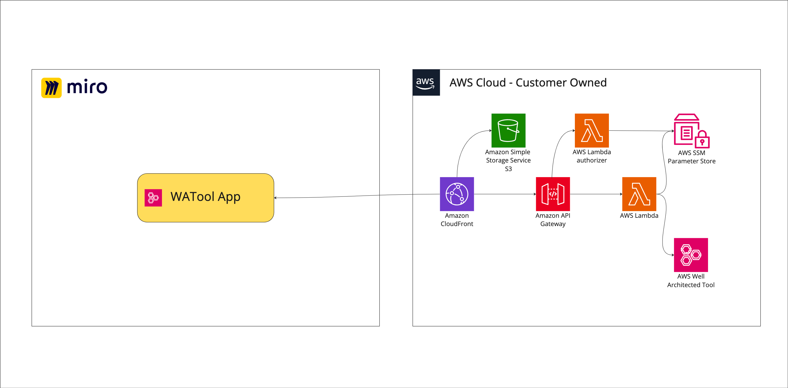
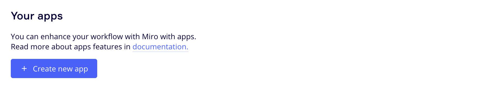
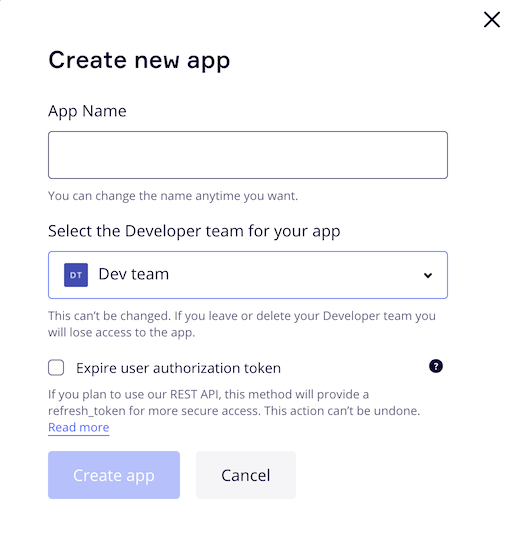
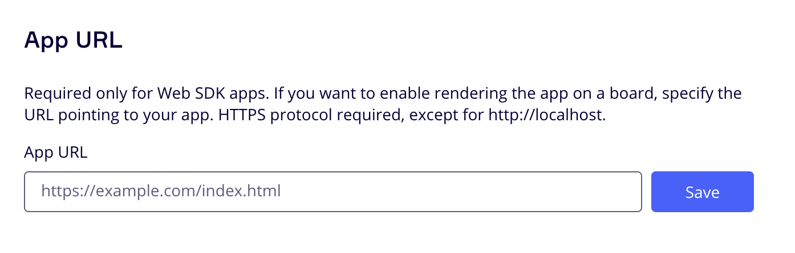
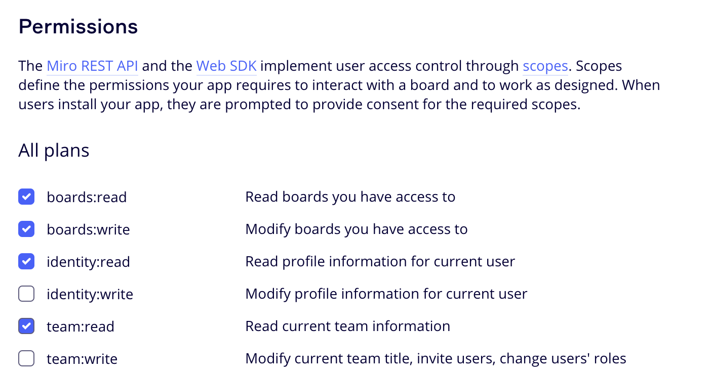

# Well-Architected application for Miro

The Well-Architected Integration application is an integrated Miro application that provides access to the Well-Architected Tool for obtaining workloads, lenses, and answers. The application exports answers to a Miro board for team collaboration and tracking.

## Workflow overview

This integration let you import Well-Architected High/Medium risk items (HRIs) to Miro board as Miro
cards. Cards then could be used to improve interaction along risk mitigation discussion.

- Organize cards with one of the project management templates from Miroverse
(https://miro.com/miroverse/project-management/ ), for instance Kanban board.
- Collaborate in a hybrid workplace (https://miro.com/blog/hybrid-collaboration-field-guide/ ).
- Distribute tasks between team members, prioritize, define project deadlines, mention your team
- members, uncover fun of visual online collaboration.
- Use existing integrations with Jira to create task directly from the board based on HRI card, no
more copy-pasting.

## Stack

Summary of the current stack:

-   **Frontend** - Built with React as the core framework, utilizing [Mirotone](https://www.mirotone.xyz/css) for UI, and the Miro SDK for Miro dashboard integration.
-   **API** - The RestAPI is managed by Amazon API Gateway with AWS Lambda authorizer.
-   **Auth** - Miro provides JSON Web Tokens (JWT) and, along with API Gateway, fine-grained authorization on the data types that users can access.
-   **Backend** - AWS Lambdas, written in Typescript, integrated with the Well-Architected Tool and Parameter store.

### Backend Services

| Service      | Language   | Description                                                                                                                          |
| ------------ | ---------- | ------------------------------------------------------------------------------------------------------------------------------------ |
| onBoarding   | Typescript | Provides onboarding functionality during the first run of the application. It includes setup Miro metadata as part of the operation. |
| WorkloadList | Typescript | Provides a list of Workloads. Retrieves the list of Well-Architected Workloads objects.                                              |
| Workload     | Typescript | Provides Workloads. Retrieves the list of Well-Architected Workloads objects.                                                        |
| AnswersList  | Typescript | Provides list of Answers related to Lens.                                                                                            |

## High level infrastructure architecture

## Getting Started

### Deployment

#### Prerequisites

1. AWS account with access to create
    - [IAM roles](https://docs.aws.amazon.com/IAM/latest/UserGuide/id_roles.html)
    - [ECR](https://docs.aws.amazon.com/AmazonECR/latest/userguide/what-is-ecr.html) repositories
    - [Lambda functions](https://docs.aws.amazon.com/lambda/latest/dg/welcome.html)
    - [API Gateway](https://docs.aws.amazon.com/apigateway/latest/developerguide/welcome.html) endpoints
    - [S3 buckets](https://docs.aws.amazon.com/AmazonS3/latest/userguide/Welcome.html)
    - [CloudFront distributions](https://docs.aws.amazon.com/AmazonCloudFront/latest/DeveloperGuide/Introduction.html)
2. [AWS CLI](https://docs.aws.amazon.com/cli/latest/userguide/cli-chap-install.html) installed and configured
3. [NodeJS](https://nodejs.org/en/download/) installed
4. [NPM](https://www.npmjs.com/get-npm) installed
5. [AWS CDK](https://docs.aws.amazon.com/cdk/latest/guide/getting_started.html) installed
6. [Docker](https://docs.docker.com/get-docker/) installed

To begin integrating WATool with the Miro application, follow these steps to deploy infrastructure in your AWS account:

1. Configure CLI access to AWS account via [profile](https://docs.aws.amazon.com/cli/latest/userguide/getting-started-quickstart.html) or [environment variables](https://docs.aws.amazon.com/cli/latest/userguide/cli-configure-envvars.html)
2. Export AWS_REGION environment variable by run `export AWS_REGION='your region here'` (i.e. `export AWS_REGION='eu-north-1'`), as Lambda function deployment script relies on that
3. Bootstrap CDK stack in the target account: `cdk bootstrap aws://<account_id>/<region>`
4. Docker buildx is required to build Lambda images. It could be either used from [Docker Desktop](https://www.docker.com/products/docker-desktop/) package - no need in steps 4.i and 4.ii in this case; or installed separately (steps below developed and tested on [AWS Cloud9](https://aws.amazon.com/cloud9/)):
   1. [Binary installation manual](https://docs.docker.com/build/install-buildx/)
   2. To enable multiarch building capability launch `docker run --rm --privileged multiarch/qemu-user-static --reset -p yes`
5. For easy deployment just run `npm run deploy` from the project root folder. This will deploy all the necessary stacks in the target account.

### Miro Application

1. Familiarize yourself with Miro's Developer Platform:
   Visit the Miro Developer Platform documentation (**[https://developers.miro.com/docs](https://developers.miro.com/docs)**) to learn about the available APIs, SDKs, and other resources that can help you build your app.
2. Create [Miro Developer Team](https://developers.miro.com/docs/create-a-developer-team)

    

3. Go to the Miro Developer Dashboard (**[https://miro.com/app/dashboard/](https://miro.com/app/dashboard/)**
   ) and click "Create new app". Fill in the necessary information about your app, such as its name, select Developer team. Note: you don't need to check the "Expire user authorization token" checkbox. Click "Create app" to create your app.

    

    

4. Please enter the CloudFront URL that you obtained after the deployment process.

    

5. Add necessary permission.

    

6. Install the app to the team.
   
7. Back to the Miro Developer Dashboard, click "Apps" and start working with just installed app.

## License

This sample code is made available under the MIT-0 license. See the LICENSE file.
