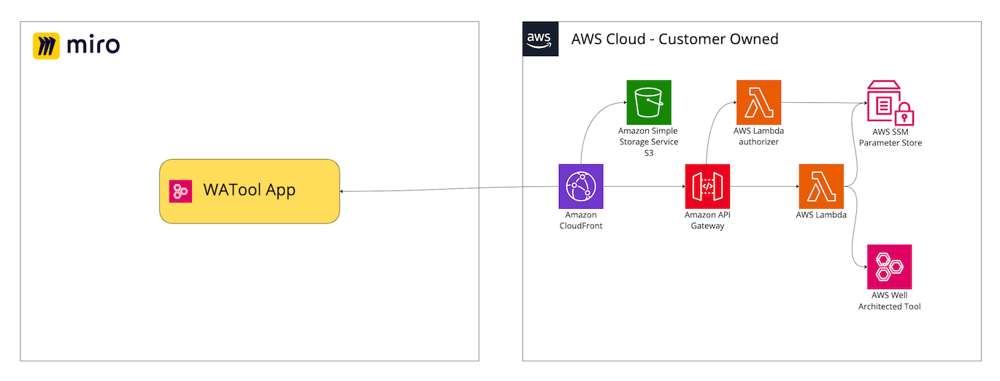

#  Well-Architected application for Miro

The Well-Architected Integration application is an integrated Miro application that provides access to the Well-Architected Tool for obtaining workloads, lenses, and answers. The application exports answers to a Miro board for team collaboration and tracking.

## Stack

Summary of the current stack:

- **Frontend** - Built with React as the core framework, utilizing [Mirotone](https://www.mirotone.xyz/css) for UI, and the Miro SDK for Miro dashboard integration.
- **API** - The RestAPI is managed by Amazon API Gateway with AWS Lambda authorizer.
- **Auth** - Miro provides JSON Web Tokens (JWT) and, along with API Gateway, fine-grained authorization on the data types that users can access.
- **Backend** - AWS Lambdas, written in Typescript, integrated with the Well-Architected Tool and Parameter store.

### Backend Services
Service | Language  | Description
------------------------------------------------- |--------------------------------------------------------------------------------------------------------------------------------------------------| ---------------------------------------------------------------------------------
onBoarding | 	Typescript |	Provides onboarding functionality during the first run of the application. It includes setup Miro metadata as part of the operation. 
WorkloadList | 	Typescript |	Provides a list of Workloads. Retrieves the list of Well-Architected Workloads objects.
Workload | 	Typescript   |	Provides Workloads. Retrieves the list of Well-Architected Workloads objects.
AnswersList | 	Typescript |	Provides list of Answers related to Lens.

## High level infrastructure architecture

## Getting Started

### Deployment

To begin integrating WATool with the Miro application, follow these steps to deploy it in your AWS account:
TBD

### Miro Application
1. Familiarize yourself with Miro's Developer Platform:
   Visit the Miro Developer Platform documentation (**[https://developers.miro.com/docs](https://developers.miro.com/docs)**) to learn about the available APIs, SDKs, and other resources that can help you build your app.
2. Create [Miro Developer Team](https://developers.miro.com/docs/create-a-developer-team)

   

3. Go to the Miro Developer Dashboard (**[https://miro.com/app/dashboard/](https://miro.com/app/dashboard/)**
   ) and click "Create new app". Fill in the necessary information about your app, such as its name, select Developer team. Note: you don't need to check the "Expire user authorization token" checkbox. Click "Create app" to create your app.

   

   

4. Please enter the CloudFront URL that you obtained after the deployment process.

   

5. Add necessary permission.

   

6. Install the app to the team.
   

## License
his sample code is made available under the MIT-0 license. See the LICENSE file.